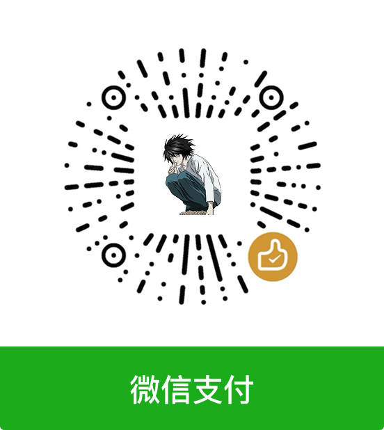

<p align="center">
  
</p>

<h1 align="center">Keyden</h1>

<p align="center">
  A clean and elegant macOS menu bar TOTP authenticator
</p>

<p align="center">
  English · <a href="README.zh-CN.md">中文</a>
</p>

<p align="center">
  
  
  
  <a href="https://github.com/tasselx/Keyden/releases"></a>
</p>

<p align="center">
  
  &nbsp;&nbsp;
  
</p>

---

## ✨ Features

| | Feature |
|:---:|:---|
| 🔐 | **Secure Storage** - TOTP secrets stored in macOS Keychain with encryption |
| 📋 | **One-Click Copy** - Click to copy verification codes instantly |
| 📷 | **QR Code Support** - Scan QR codes or export tokens as QR images |
| 📥 | **Batch Import** - Import multiple accounts via clipboard or input field |
| 🔄 | **Google Authenticator Migration** - Import accounts from Google Authenticator via migration QR code or link |
| ☁️ | **GitHub Gist Sync** - Optional sync via private GitHub Gist |
| 💾 | **Offline First** - Works without internet, all data encrypted locally |
| 🎨 | **Theme Support** - Light/Dark mode, follows system preference |
| 🌍 | **Multi-Language** - English, Simplified Chinese, Traditional Chinese, Japanese |
| 📌 | **Pin & Reorder** - Pin frequently used accounts, drag to reorder |
| 📂 | **Group View** - Group accounts by issuer for better organization |
| ⌨️ | **Global Hotkey** - Customizable keyboard shortcut (default: ⌘⇧K) |
| 🖥️ | **CLI Tool** - Command-line interface for scripts and automation |
| 🔄 | **Import/Export** - Backup and restore your tokens easily |
| 🚀 | **Launch at Login** - Start automatically with your Mac |

---

## 📦 Installation

### Homebrew (Recommended)

```bash
brew install --cask tasselx/tap/keyden
```

### Manual Download

Download the latest DMG from [Releases](https://github.com/tasselx/Keyden/releases)

## ⚠️ FAQ

### Screen Recording Permission Issue

Since the app is not signed with a paid Apple Developer account, macOS may not properly recognize the screen recording permission after installing a new version.

**Solution:**

1. Open "System Settings" → "Privacy & Security" → "Screen Recording"
2. Find Keyden and click "-" to remove the authorization
3. Reopen Keyden, the system will request permission again
4. Click "+" to add Keyden and grant permission

### Keychain Access Prompt

After installing a new version, macOS may prompt you to authorize Keychain access. This is normal because the app signature changes with each update.

**Solution:**

Simply click "Always Allow" or "Allow" when prompted. Your TOTP secrets are stored securely in the macOS Keychain and will remain intact after the update.

### "Keyden is damaged and can't be opened" Error

Since the app is not notarized by Apple, macOS Gatekeeper may block it and show a "damaged" error message.

**Solution:**

Open Terminal and run:

```bash
xattr -cr /Applications/Keyden.app
```

This removes the quarantine attribute and allows the app to run normally.

---

## 🚀 Usage

1. Launch Keyden - icon appears in menu bar
2. Click "+" to add TOTP accounts (scan QR or enter manually)
3. Click any code to copy to clipboard
4. Right-click for more options (pin, delete, export QR)

### Command Line Interface (CLI)

Keyden includes a CLI tool for scripts and automation.

**Installation:**

- **One-Click Install**: Right-click any account → "Copy CLI Command" → prompted to install if not found
- **From Settings**: Settings → General → CLI Tool → Install
- **Manual**: The CLI is bundled inside the app at `Keyden.app/Contents/Resources/CLI/keyden`

```bash
# Usage
keyden get GitHub                    # Get TOTP code for GitHub
keyden get GitHub:user@example.com   # Specific account (issuer:account format)
keyden get GitHub user@example.com   # Same as above (space separated)
keyden list                          # List all accounts with codes
keyden search google                 # Search accounts
keyden help                          # Show help

# Use in scripts
CODE=$(keyden get GitHub)
echo "Your code is: $CODE"

# Auto-fill example (copy to clipboard)
keyden get GitHub | pbcopy
```

> 💡 **Tip**: When you have multiple accounts under the same issuer (e.g., multiple GitHub accounts), use the `issuer:account` format to specify which one.

### GitHub Gist Sync

1. Go to Settings → Sync
2. Create a [GitHub Personal Access Token](https://github.com/settings/tokens) with `gist` scope
3. Enter your token and enable sync
4. Your tokens will be synced to a private Gist

---

## 🔗 Quick Start - Enable 2FA on Popular Platforms

<details>
<summary><b>🌐 Social & Communication</b></summary>

| Platform | 2FA Settings |
|:---|:---|
| 🔵 Google | [Security Settings](https://myaccount.google.com/signinoptions/two-step-verification) |
| 📘 Facebook | [Security Settings](https://www.facebook.com/settings?tab=security) |
| 🐦 X (Twitter) | [Account Security](https://twitter.com/settings/account/login_verification) |
| 📸 Instagram | [Security Settings](https://www.instagram.com/accounts/two_factor_authentication/) |
| 🎮 Discord | [Account Settings](https://discord.com/channels/@me) → User Settings → My Account |
| 🐦 Reddit | [Account Settings](https://www.reddit.com/settings/privacy) |
| 💬 Slack | Workspace Settings → Account Settings → Two-Factor Authentication |

</details>

<details>
<summary><b>💻 Developer Tools</b></summary>

| Platform | 2FA Settings |
|:---|:---|
| 🐙 GitHub | [Two-Factor Authentication](https://github.com/settings/two_factor_authentication/setup/intro) |
| 🦊 GitLab | [Account Security](https://gitlab.com/-/profile/two_factor_auth) |
| 🪣 Bitbucket | [Account Security](https://bitbucket.org/account/settings/two-step-verification/manage) |
| 🐳 Docker Hub | [Account Security](https://hub.docker.com/settings/security) |
| 📦 npm | [Account Settings](https://www.npmjs.com/settings/~/tfa) |

</details>

<details>
<summary><b>☁️ Cloud Services</b></summary>

| Platform | 2FA Settings |
|:---|:---|
| ☁️ AWS | [IAM Security](https://console.aws.amazon.com/iam/home#/security_credentials) |
| ☁️ Azure | [Security Info](https://mysignins.microsoft.com/security-info) |
| ☁️ Google Cloud | [Security Settings](https://myaccount.google.com/signinoptions/two-step-verification) |
| ☁️ DigitalOcean | [Account Security](https://cloud.digitalocean.com/account/security) |
| 🔷 Cloudflare | [Account Security](https://dash.cloudflare.com/profile/authentication) |

</details>

<details>
<summary><b>🎮 Gaming Platforms</b></summary>

| Platform | 2FA Settings |
|:---|:---|
| 🎮 Steam | [Steam Guard](https://store.steampowered.com/twofactor/manage) |
| 🎮 Epic Games | [Account Security](https://www.epicgames.com/account/password) |

</details>

<details>
<summary><b>💰 Finance & Payment</b></summary>

| Platform | 2FA Settings |
|:---|:---|
| 💰 PayPal | [Security Settings](https://www.paypal.com/myaccount/settings/security) |
| 💰 Coinbase | [Security Settings](https://www.coinbase.com/settings/security) |
| 💰 Binance | [Security Settings](https://www.binance.com/en/my/security) |

</details>

<details>
<summary><b>🔐 Password Managers</b></summary>

| Platform | 2FA Settings |
|:---|:---|
| 🔐 1Password | [Account Settings](https://my.1password.com/profile) |
| 🔐 Bitwarden | [Account Settings](https://vault.bitwarden.com/#/settings/security/two-factor) |

</details>

<details>
<summary><b>📱 Other Services</b></summary>

| Platform | 2FA Settings |
|:---|:---|
| 🟦 Microsoft | [Security Options](https://account.live.com/proofs/manage/additional) |
| 🍎 Apple | [Account Security](https://appleid.apple.com/account/manage) |
| 🟠 Amazon | [Two-Step Verification](https://www.amazon.com/a/settings/approval) |
| 📦 Dropbox | [Security Settings](https://www.dropbox.com/account/security) |
| 💼 LinkedIn | [Two-Step Verification](https://www.linkedin.com/psettings/two-step-verification) |
| 📧 ProtonMail | [Account Settings](https://account.proton.me/u/0/mail/account-password) |
| 🎵 Spotify | [Account Security](https://www.spotify.com/account/security/) |
| 🛒 Shopify | [Account Security](https://accounts.shopify.com/security) |
| 📝 Notion | [Account Settings](https://www.notion.so/my-account) → Security |
| 🎨 Figma | [Account Settings](https://www.figma.com/settings) |

</details>

> 💡 **Tip**: For platforms not listed, 2FA settings are typically found in **Account Settings → Security** or **Privacy & Security**.

---

## 🛠 Build from Source

**Requirements:** macOS 12.0+ / Xcode 15.0+

```bash
git clone https://github.com/tasselx/Keyden.git
cd Keyden

make build      # Build universal app
make dmg        # Create DMG installer
make clean      # Clean build artifacts
```

<details>
<summary>More build options</summary>

```bash
make build-arm      # Apple Silicon only
make build-intel    # Intel only
make build-all      # Universal
```

</details>

---

## 🧰 Tech Stack

- **SwiftUI + AppKit** - Native macOS UI
- **CryptoKit** - TOTP generation
- **Keychain Services** - Secure storage
- **Vision Framework** - QR code scanning

---

## ☕ Donate

If you find Keyden helpful, consider buying me a coffee ☕

Your sponsorship can help me purchase an Apple Developer account, which will allow the app to be properly signed and notarized — no more "damaged" warnings!

<p align="center">
  
  &nbsp;&nbsp;&nbsp;&nbsp;
  
</p>

---

## 🎯 Also by Author

| App | Description |
|:---|:---|
| [LanShare-Mac](https://github.com/tasselx/LanShare-Mac) | A simple and efficient LAN file sharing tool for macOS |

---

## ⭐ Star History

<a href="https://github.com/starcat-app/Starcat" target="_blank" rel="noopener noreferrer">
  <picture data-starcat-star-history>
    <source
      media="(prefers-color-scheme: dark)"
      srcset="https://history.starcat.ink/embed/v1/repos/tasselx/Keyden/star-history.svg?theme=dark&amp;locale=en">
    
  </picture>
</a>

<p align="center">
  <sub>MIT License © <a href="https://github.com/tasselx">tasselx</a></sub>
</p>
